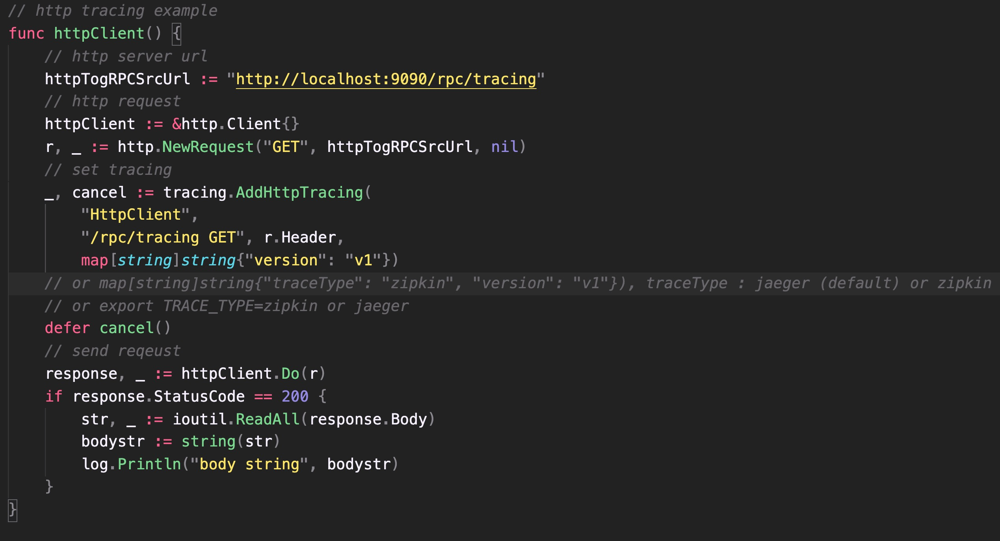
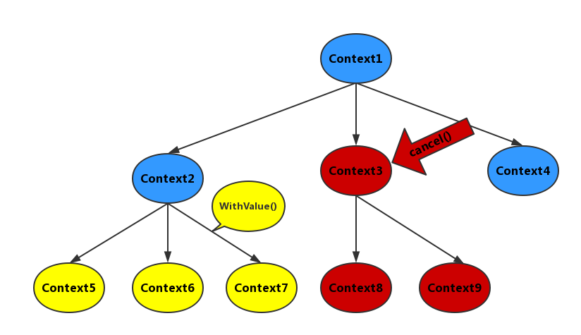

[](https://pkg.go.dev/github.com/codeandcode0x/traceandtrace-go)


# MSA Distributed link tracking
微服务架构 —— 分布式链路追踪

## Introduction
traceandtrace-go is go tracing lib. It integrate multi tracer such as jeager,zipkin,skywalking and so on <br>

## Version introduction
### v1.0.0
- only support jeager 
- support http and gRPC (or both) tracing
- support sampler, sampler type and collector env setting

### v1.0.3
- support jeager and zipkin

## API
[godoc](https://pkg.go.dev/github.com/codeandcode0x/traceandtrace-go)

## Env Setting

|  Env   | Value  |
|  ----  | ----  |
|  TRACE_SAMPLER_TYPE  | const/probabilistic/ratelimiting/remote  |
|  TRACE_SAMPLER_PARAM  | 0-1  |
|  TRACE_ENDPOINT  | http://localhost:14268/api/traces (jaeger) or http://localhost:9411/api/v2/spans (zipkin) |
|  TRACE_AGENT_HOST  | localhost:6831 (jaeger) |
|  TRACE_REPORTER_LOG_SPANS  | false or ture  |
|  TRACE_TYPE  | jaeger or zipkin  |
 
## Jaeger Ext field
spanKind <br>
component <br>
samplingPriority <br>
peerService <br>
peerAddress <br>
peerHostname <br>
peerIpv4 <br>
peerIpv6 <br>
peerPort <br>
httpUrl <br>
httpStatusCode <br>
dbStatement <br>
dbInstance <br>
dbType <br>
httpMethod <br>
dbUser <br>
messageBusDestination <br>

## Quick Start

### Start Jaeger

```shell
docker run -d --name jaeger \
-e COLLECTOR_ZIPKIN_HOST_PORT=:9411 \
-p 5775:5775/udp \
-p 6831:6831/udp \
-p 6832:6832/udp \
-p 5778:5778 \
-p 16686:16686 \
-p 14268:14268 \
-p 14250:14250 \
-p 9411:9411 \
ethansmart-docker.pkg.coding.net/istioalltime/roandocker/jaegertracing-all-in-one:1.22.0


```

### Import Package

```shell
go get github.com/codeandcode0x/traceandtrace-go
```

### HTTP tracing

Create a trace on the http request method side.

tags are map[string]string type, you can pass logs k-v, tag and field.


### gRPC tracing
Create a trace on the rpc request method side

**client**

```go
import (
    tracing "github.com/codeandcode0x/traceandtrace-go"
)

// create rpc options
rpcOption, closer := tracing.AddRpcClientTracing("RpcClientExample")
defer closer.Close()

// dial
conn, err := grpc.Dial(addr, grpc.WithInsecure(), rpcOption)
if err != nil {
}
...
```
**server**

```go
import (
    tracing "github.com/codeandcode0x/traceandtrace-go"
)

//No need to request other rpc services
rpcOption, closer, _ := rpcTracing.AddRpcServerTracing(serviceName)
defer closer.Close()

//Add rpcOptions to the server-side monitoring process
s := grpc.NewServer(rpcOption)

```

Need to request another rpc service

```go
rpcOption, closer, tracer := rpcTracing.AddRpcServerTracing(serviceName)
defer closer.Close()

//Add rpcOptions to the server-side monitoring process
s := grpc.NewServer(rpcOption)
//rpc 请求
newRpcServiceReq(tracer)

...
```

### Http to gRPC tracing
```go
//grpc request
func RpcClient(ptx context.Context) string {
	rpcOption, closer := tracing.AddRpcClientTracing(
		"RpcClient",
		map[string]string{"version": "v1"})
    // or map[string]string{"traceType": "zipkin", "version": "v1"}), traceType : jaeger (default) or zipkin
	// or export TRACE_TYPE=zipkin or jaeger
	defer closer.Close()
	address := "localhost:22530"
	conn, err := grpc.Dial(address, grpc.WithInsecure(), rpcOption)
	if err != nil {
	}
	defer conn.Close()
	c := pb.NewGreeterClient(conn)
	// Contact the server and print out its response.
	name := "rpc test"
	if len(os.Args) > 1 {
		name = os.Args[1]
	}
	// use parent context
	ctx, cancel := context.WithTimeout(ptx, time.Second)
	defer cancel()
	r, err := c.SayHello(ctx, &pb.HelloRequest{Name: name})
	if err != nil {
		log.Println("error:", err)
	}

	log.Printf("Greeting: %s", r.Message)
	return r.Message
}
```
**ptx** is parent context, it can create sub-context trace span <br>
To call gRPC on the http server side, you need to add the parent context to the gRPC client. For details, you can see the [example](example/http/httpServer.go) .

## Concurrent Processing
### goroutine context control

- By context.Background() create sub-coroutine context, form a session tree (coroutine tree), which is thread-safe (there is no data race problem) ;
- By context WithCancel() create sub-coroutine sessions and manage coroutine tasks ;
- every context will carry related data of parent trace and child span ;



### Trace Job Control
start and end trace job

```go
// start job
ch := make(chan context.Context, 0)
go doTask(ch, ctx, r, svc, traceType, tags)

// end job (receive signal)
pctx := <-ch
pch <- pctx

// release job
for {
    select {
        case <-ctx.Done():
            cancel()
            return
        default:
            break
    }
}
```


    