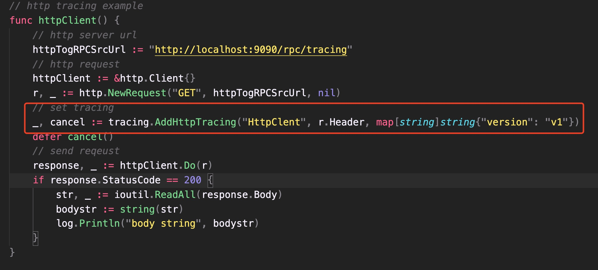
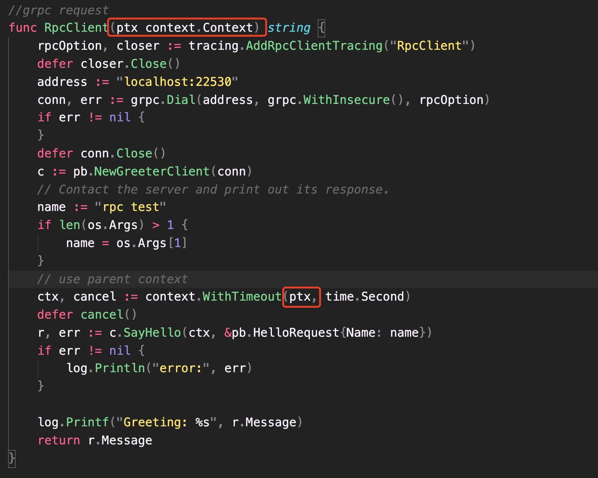

[](https://pkg.go.dev/github.com/codeandcode0x/traceandtrace-go)


# MSA Distributed link tracking
微服务架构 —— 分布式链路追踪

## Introduction
traceandtrace-go is go tracing lib. It integrate multi tracer such as jeager,zipkin,skywalking and so on <br>

## Version introduction
- v1.0.0 only support jeager 
- support http and gRPC (or both) tracing
- support sampler, sampler type and collector env setting

## API
[godoc](https://pkg.go.dev/github.com/codeandcode0x/traceandtrace-go)

## quick start

### start jaeger

```shell
docker run \
-p 5775:5775/udp \
-p 16686:16686 \
-p 6831:6831/udp \
-p 6832:6832/udp \
-p 5778:5778 \
-p 14268:14268 \
ethansmart-docker.pkg.coding.net/istioalltime/roandocker/jaegertracing-all-in-one:1.22.0

```

### import package

```shell
go get github.com/codeandcode0x/traceandtrace-go
```

### HTTP tracing

Create a trace on the http request method side.

tags are map[string]string type, you can pass logs k-v, tag and field.


### RPC tracing
Create a trace on the rpc request method side

- **client**

```go
import (
    tracing "github.com/codeandcode0x/traceandtrace-go"
)

// create rpc options
rpcOption, closer := tracing.AddRpcClientTracing("RpcClientExample")
defer closer.Close()

// dial
conn, err := grpc.Dial(addr, grpc.WithInsecure(), rpcOption)
if err != nil {
}
...
```
- **server**

```go
import (
    tracing "github.com/codeandcode0x/traceandtrace-go/wrapper/rpc"
)

//No need to request other rpc services
rpcOption, closer, _ := rpcTracing.AddRpcServerTracing(serviceName)
defer closer.Close()

//Add rpcOptions to the server-side monitoring process
s := grpc.NewServer(rpcOption)

```

Need to request another rpc service

```go
rpcOption, closer, tracer := rpcTracing.AddRpcServerTracing(serviceName)
defer closer.Close()

//Add rpcOptions to the server-side monitoring process
s := grpc.NewServer(rpcOption)
//rpc 请求
newRpcServiceReq(tracer)

...
```

### Http to gRPC tracing

To call gRPC on the http server side, you need to add the parent context to the rpc client. For details, you can see the [example](example/http/httpServer.go) .

## Concurrent Processing
### goroutine context control

- By context.Background() create sub-coroutine context, form a session tree (coroutine tree), which is thread-safe (there is no data race problem) ;
- By context WithCancel() create sub-coroutine sessions and manage coroutine tasks ;
- every context will carry related data of parent trace and child span ;


### trace job control
start and end trace job

```go
// start job
ch := make(chan context.Context, 0)
go doTask(ch, ctx, r, svc, traceType, tags)

// end job (receive signal)
pctx := <-ch
pch <- pctx

// release job
for {
    select {
        case <-ctx.Done():
            cancel()
            return
        default:
            break
    }
}
```


    