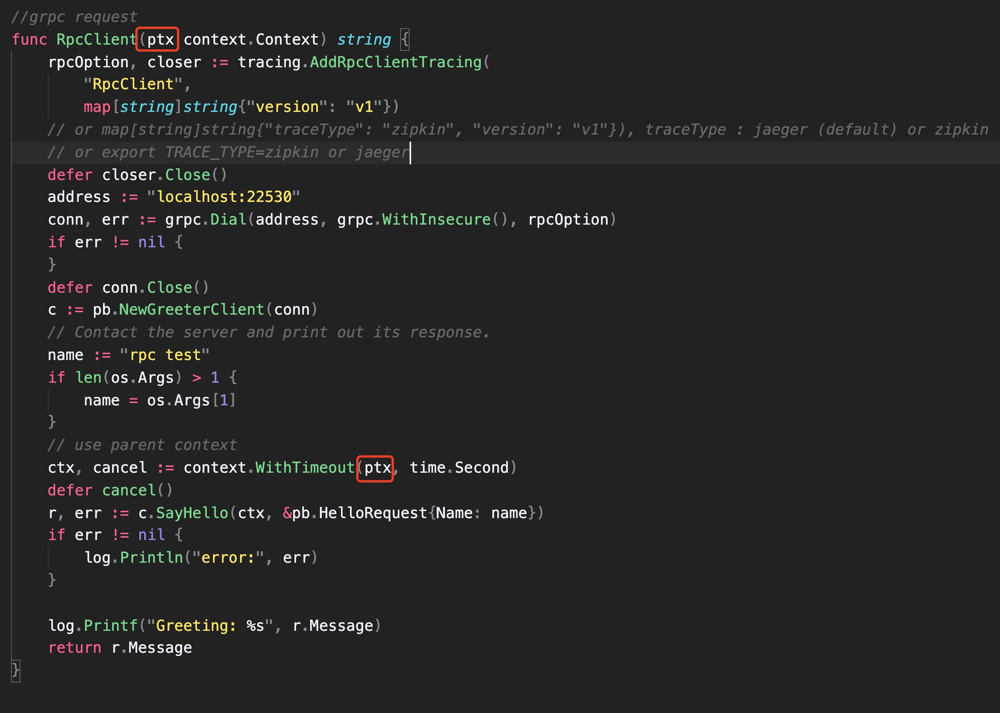

# 微服务架构 —— 分布式链路追踪

## 简介
traceandtrace-go 是 go 语言 tracing lib, 可以集成不同的 tracer 如: jeager、zipkin、skywalking ... <br>

## 版本介绍
- v1.0.0 目前只支持 jeager 
- 支持 http 和 gRPC (or both) 调用链路
- 支持采样率、采样类型、收集器等配置

## API


## 快速开始

### 启动 Jaeger

```shell
docker run \
-p 5775:5775/udp \
-p 16686:16686 \
-p 6831:6831/udp \
-p 6832:6832/udp \
-p 5778:5778 \
-p 14268:14268 \
ethansmart-docker.pkg.coding.net/istioalltime/roandocker/jaegertracing-all-in-one:1.22.0

```

### 引入 SDK 包

```shell
go get github.com/codeandcode0x/traceandtrace-go
```


### HTTP 请求链路
在 http request 方法侧创建 trace

代码如下:
- **client 端**

```go
import (
    tracing "github.com/codeandcode0x/traceandtrace-go"
)


// 在 func 中 或者 middleware 中添加
_, cancel := tracing.AddHttpTracing("HttpTracingTest", [your http Header], map[string]string{"version": "v1"})
defer cancel()

```

- **server 端**

```go
import (
    tracing "github.com/codeandcode0x/traceandtrace-go"
)

// 在 func 中 或者 middleware 中添加
_, cancel := tracing.AddHttpTracing("HttpTracingTest", [your http Header], map[string]string{"version": "v1"})
defer cancel()

...
```
tags 为 map[string]string 类型, 可以传递 logs k-v, tag 和 field 


### RPC 请求链路
在 rpc request 方法侧创建 trace

- **client 端**

```go
import (
    tracing "github.com/codeandcode0x/traceandtrace-go"
)

//创建 rpc options
rpcOption, closer := tracing.AddRpcClientTracing("RpcClientExample")
defer closer.Close()

//dial
conn, err := grpc.Dial(addr, grpc.WithInsecure(), rpcOption)
if err != nil {
}
...
```
- **server 端**

```go
import (
    tracing "github.com/codeandcode0x/traceandtrace-go/wrapper/rpc"
)

//不需要请求别的 rpc 服务
rpcOption, closer, _ := rpcTracing.AddRpcServerTracing(serviceName)
defer closer.Close()

//在 server 端监听进程中加入 rpcOptions 即可
s := grpc.NewServer(rpcOption)

//------------------------------------------------

//需要请求别的 rpc 服务
rpcOption, closer, tracer := rpcTracing.AddRpcServerTracing(serviceName)
defer closer.Close()

//在 server 端监听进程中加入 rpcOptions 即可
s := grpc.NewServer(rpcOption)
//rpc 请求
newRpcServiceReq(tracer)

...
```

### Http to gRPC 链路

在 http server 端调用 gRPC, 需要在 rpc client 中加入 parent context, 详情可以查看 example 中的示例

## 并发处理
### 协程 context 管理

- 通过 context.Background() 创建子协程 context, 形成会话树 (协程树), 是线程安全的 (不存在数据竞争问题) ;
- 通过 context WithCancel() 创建子协程会话, 管理协程任务 ;
- 每个 context 会携带父类 trace 和 子 span 的相关 data


### 协程 trace job 管理和资源回收
启动和暂停 trace job

```go
//启动协程 job
ch := make(chan context.Context, 0)
go doTask(ch, ctx, r, svc, traceType, tags)

//任务结束 (接受信号)
pctx := <-ch
pch <- pctx

//资源回收 (暂停任务)
for {
    select {
        case <-ctx.Done():
            cancel()
            return
        default:
            break
    }
}
```


    